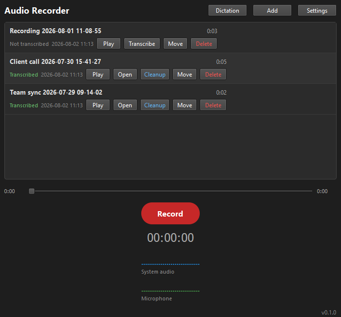
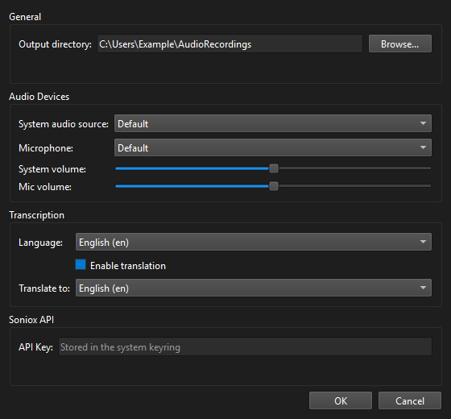

# Audio Recorder

[](https://github.com/ludekvodicka/AudioRecorder/actions/workflows/ci.yml)
[](https://github.com/ludekvodicka/AudioRecorder/actions/workflows/release.yml)
[](https://github.com/ludekvodicka/AudioRecorder/releases/latest)
[](https://github.com/ludekvodicka/AudioRecorder/releases)
[](LICENSE)

A desktop application that records a call from both sides at once: what comes out of your
speakers and what goes into your microphone, mixed into one file. Afterwards it can send the
recording to [Soniox](https://soniox.com) for a transcript with speaker labels and
timestamps, and hand that transcript to the Claude CLI for a summary.

It also does push-to-talk dictation. Hold Ctrl+Space anywhere, speak, let go, and the text
appears where your caret is.

Written for Google Meet and Teams calls in Czech and English, on Windows. It runs on macOS
and Linux too, with the caveats in the support table below.



## What it does

**Records both sides of a call.** The system output and the microphone are captured as two
separate tracks and mixed when you stop, each with its own volume. You can mute your
microphone mid-recording without stopping. Level meters show both tracks while recording, so
you can tell before the meeting whether the right devices are selected.

**Transcribes.** One click sends a recording to Soniox, which identifies the language, splits
the text by speaker and timestamps it. The result lands next to the recording as a `.md` file.
If translation is on and the call turns out to be in a different language than the one you
configured, you get both: the translation first, the original underneath.

**Summarizes.** If you have the [Claude CLI](https://claude.com/claude-code) installed, the
Cleanup button asks it to read the transcript and write a summary beside it. The prompt is a
setting, so you can ask for whatever shape of summary you want. Without the CLI installed the
button reports that plainly and nothing else breaks.

**Dictates.** Hold Ctrl+Space and speak: the text is transcribed live through Soniox and
pasted where you are typing. Ctrl+Shift+Space translates as it goes. A small pill at the
bottom of the screen shows that it is listening, and your clipboard is put back afterwards.

**Keeps the library on disk.** There is no database. An `.m4a` in the output directory is a
recording, a `.md` next to it means it has been transcribed. Rename, move or delete from the
list and the transcript and summary follow along.



## What works where

The maintainer runs this on Windows. macOS and Linux are built by CI and exercised by the
automated tests, but nobody is using them daily, so treat them as community-supported and
please report what you find.

| | Windows | macOS | Linux |
| --- | --- | --- | --- |
| Microphone recording | yes | yes, asks for permission | yes |
| System audio | yes, straight from the default output | needs a virtual device, see below | needs a `.monitor` source, see below |
| Transcription and summaries | yes | yes | yes |
| Dictation hotkey | yes | yes, needs Accessibility permission | X11 only, not on Wayland |
| Paste after dictation | yes | yes, sends Cmd+V | X11, and needs `xclip` or `xsel` |
| Tested by the maintainer | yes | no | no |

**System audio outside Windows.** Windows can record its own output directly through WASAPI
loopback, and needs no setup. macOS and Linux have no such thing, so the second track is an
ordinary input device that you route your sound into, and you pick it in Settings:

- **Linux** - PulseAudio and pipewire-pulse create a `.monitor` source for every output. Pick
  the monitor of the output you are listening on. If it does not appear in the list, route the
  application to it with `pavucontrol` instead.
- **macOS** - install a virtual audio device such as
  [BlackHole](https://github.com/ExistentialAudio/BlackHole), create a multi-output device in
  Audio MIDI Setup that feeds both your speakers and BlackHole, then pick BlackHole here.

Without one of those, the recording is your microphone only. The application says so in the
status bar rather than pretending it captured the call.

**Wayland.** No application can watch the keyboard globally on Wayland, so dictation is turned
off there and the button says why. Recording and transcription are unaffected.

## Install

Download the build for your platform from
[Releases](https://github.com/ludekvodicka/AudioRecorder/releases).

**The builds are unsigned.** Check the SHA256 of your download against `SHA256SUMS.txt` in the
same release before running it:

```sh
sha256sum Audio-Recorder-0.1.0-x64.exe                      # Linux, macOS, Git Bash
certutil -hashfile Audio-Recorder-0.1.0-x64.exe SHA256      # Windows
```

- **Windows** - a single `.exe`, or the same executable in a `.zip`. SmartScreen will warn
  about an unknown publisher.
- **macOS** - a `.dmg`. Gatekeeper refuses unsigned applications, so run
  `xattr -cr "/Applications/Audio Recorder.app"` after copying it across.
- **Linux** - an `.AppImage`, or a `.tar.gz` if you prefer to unpack it yourself. Needs
  PulseAudio or pipewire-pulse, and `xclip` or `xsel` for dictation.

The application does not update itself. It checks the Releases page once at startup and tells
you in the status bar when something newer exists.

## Set it up

**Soniox API key.** Transcription and dictation both go through Soniox, which is a paid
service. Create an account, generate a key, and paste it into Settings. It is stored in the
operating system keyring, not in a configuration file. For development or on a machine with no
keyring you can set `SONIOX_API_KEY` in the environment instead, which takes precedence.

**Claude CLI, optional.** Only needed for the Cleanup button. Install
[Claude Code](https://claude.com/claude-code) and make sure `claude` is on your PATH.

**Audio devices.** Settings lists what your system offers. Leaving both on Default is right for
most Windows machines. Devices are remembered by name, so unplugging and replugging a headset
does not silently switch you to a different microphone.

## Your data stays on your machine

Recordings, transcripts and summaries are files in the output directory you choose, and nothing
scans, syncs or uploads them on its own.

Audio leaves your computer only when you ask for it: the Transcribe button uploads that one
recording to Soniox, and dictation streams your microphone to Soniox while you hold the key.
The Cleanup button runs the Claude CLI on your machine, which sends the transcript to Anthropic
under whatever agreement your Claude account has. Read the privacy terms of both services and
decide whether the calls you record belong there. There is no telemetry and no account of our
own.

The Soniox key is held by the operating system keyring: Credential Manager on Windows, Keychain
on macOS, Secret Service on Linux. Settings live in your user configuration directory
(`%LOCALAPPDATA%\AudioRecorder` on Windows, `~/Library/Application Support/AudioRecorder` on
macOS, `~/.config/AudioRecorder` on Linux), never next to the executable.

Recording a call may need everyone's consent where you live. That is on you, not on the tool.

## Build from source

Python 3.12 or newer.

```sh
pip install -e ".[dev]"
python -m audiorecorder
```

Checks and packaging:

```sh
ruff check .
pytest
python scripts/build.py package   # writes installers into release/
```

Linux also needs the Qt and PortAudio system libraries; the list CI installs is in
`.github/workflows/ci.yml`. The AppImage step needs `appimagetool` on PATH.

The tests cover the parts that need no hardware: the transcript format, the mixing maths, the
settings, the recording scanner and the push-to-talk logic. Everything else needs a real
machine, and `docs/manual-test-checklist.md` lists what to try before a release.

## Contributing

Bug reports and focused pull requests are welcome, see [CONTRIBUTING.md](CONTRIBUTING.md). For
security issues follow [SECURITY.md](SECURITY.md) rather than opening a public issue.

## Licence

GPL-3.0-only, see [LICENSE](LICENSE). The application links PyQt6, which is itself GPL-3.0, so
the builds are GPL v3 and so is the source. Everything else that ships inside a build is listed
in [THIRD-PARTY.md](THIRD-PARTY.md).
